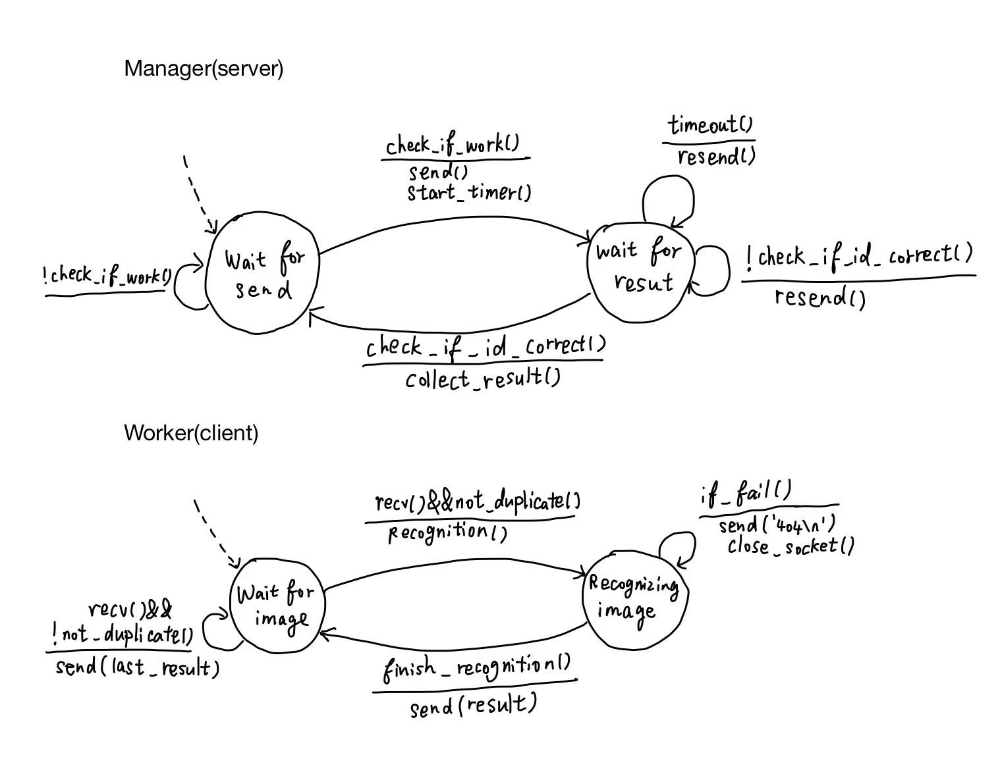
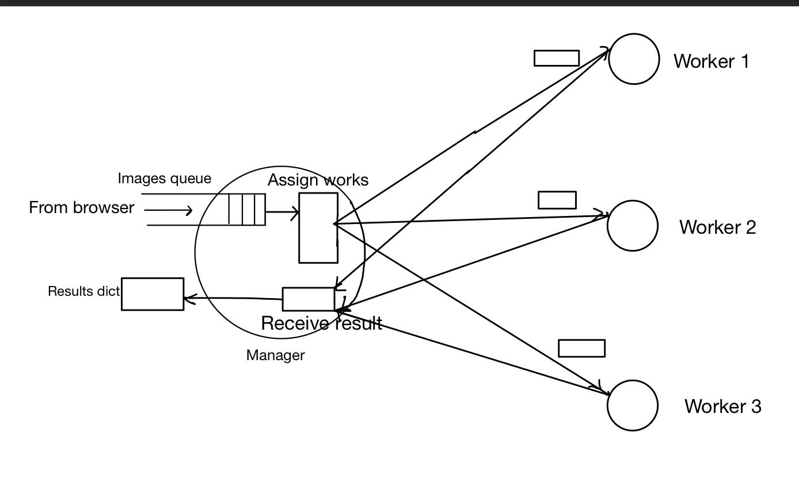
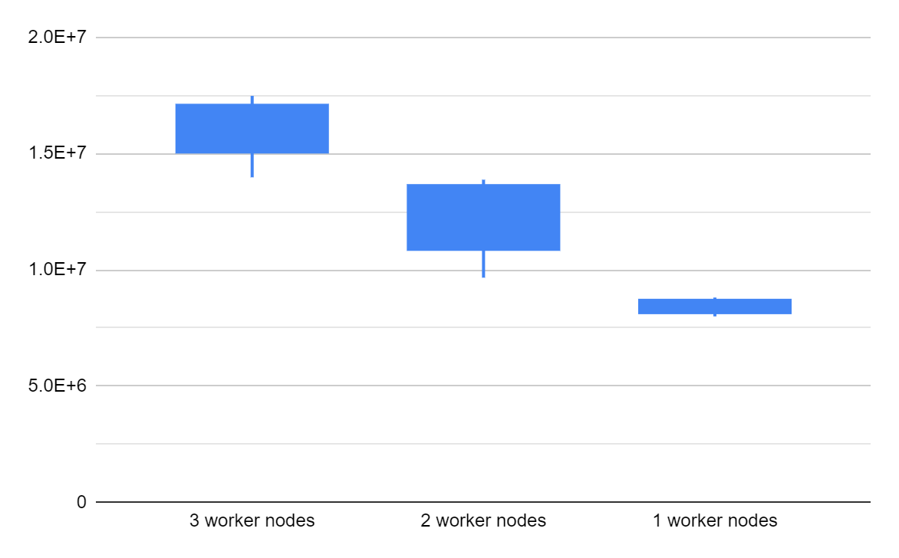
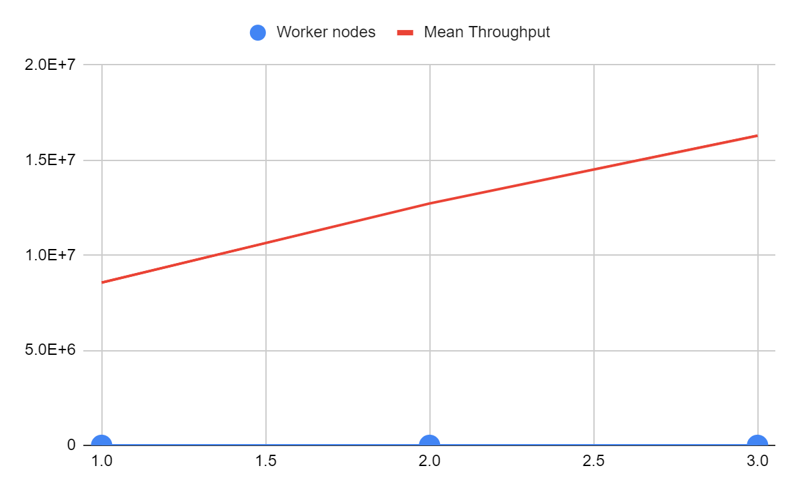
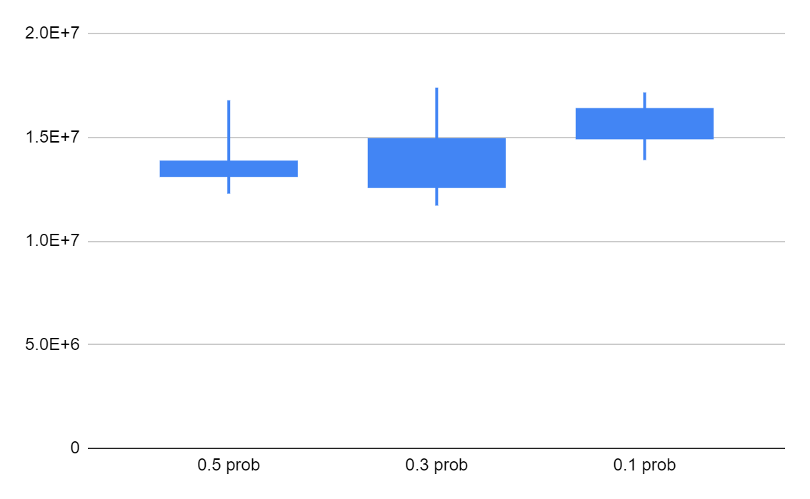
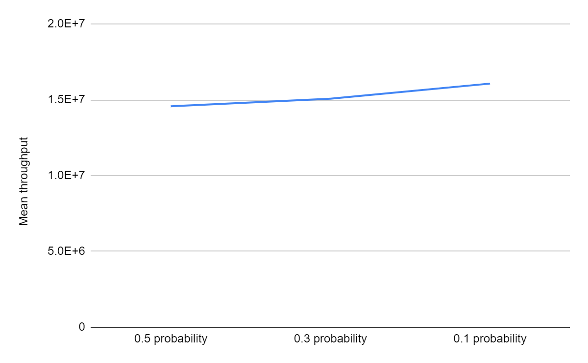
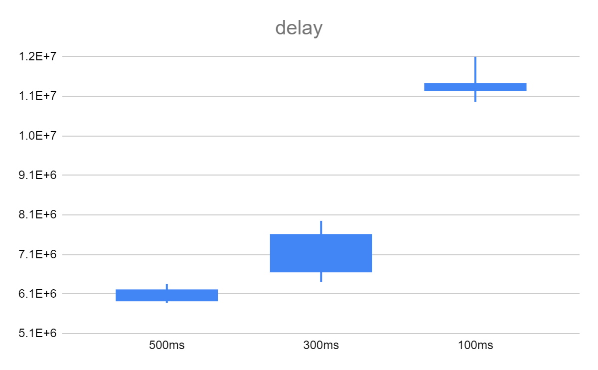
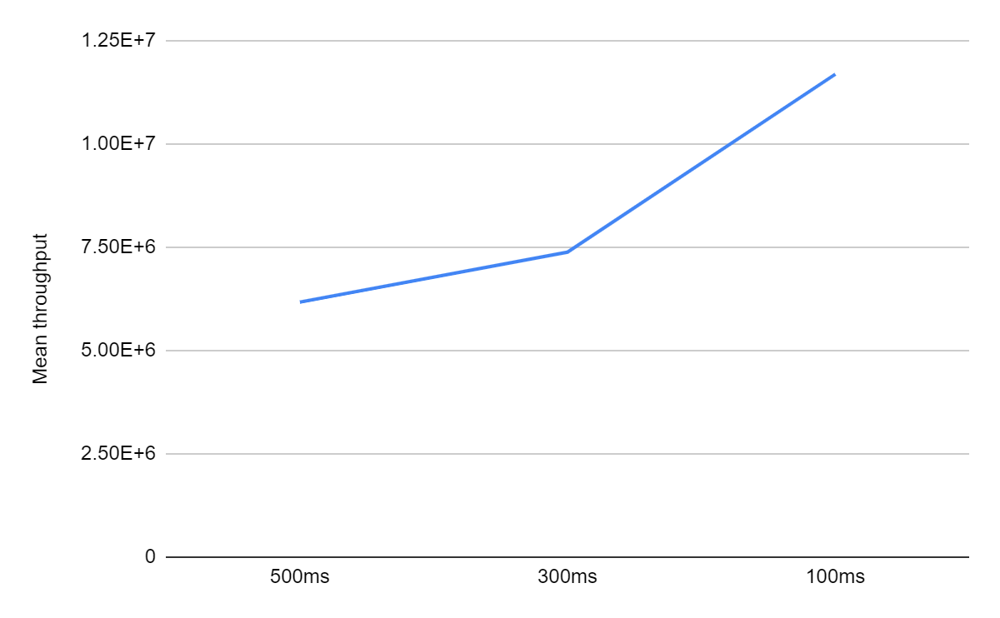
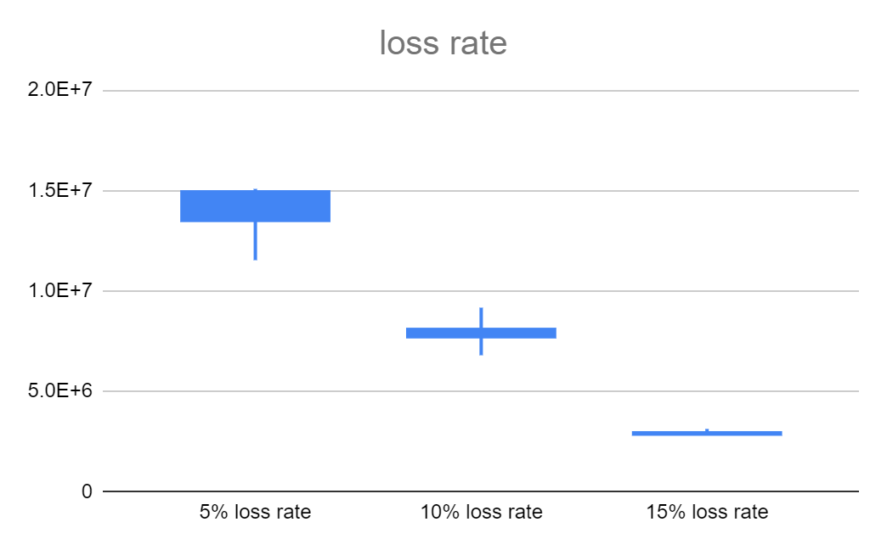
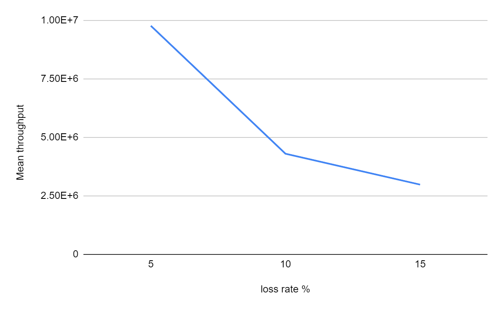

# Image Recognition Website using Socket Programming
#### Team members:

- **Yanchong Peng**: Implementation of the sockets connection between manager and workers, the assignment system of manager and the communication protocol between manager and worker.
- **Zhenghang Yin**: Full-stack programming with the Flask framework written in Python, and collaborating with Yanchong to work on the automation of the whole project frame.

- **Jinghao Ye**: Project experiment and evaluation

- **Yuhang Sun**: Implementation of GoogleNet, implementation of workers, base code of socket and distribution of workers, partial design of protocol between the manager and the worker, GENI nodes deployment

## Introduction

This application has a web interface that allows the client to upload multiple images simultaneously on the browser and send image recognition queries to the server that provides the image recognition service. The front-end of the web page is implemented using HTML5 technology and Websocket, and the back-end manager gets the results and returns WS messages to notify the web end to update the results. The actual image recognition service is implemented by several working nodes. The manager node (server) is responsible for assigning images to the available worker nodes and sending the results generated by the worker nodes back to the browser. In addition, the manager node will measure the network performance, such as throughput, to evaluate the impact of the network on the application.

The communication between the manager node and the worker nodes is established through socket programming. Our design is such that each worker node can be considered as an independent client, while the manager node can be considered as a multi-threaded server.

**Learning Outcomes**

1. Full-stack programming with the Vue.js and Flask framework written in Python.

2. Socket programming

3. Design of protocol between the manager and the worker

4. Design of images recognition assignments on the manager node

5. Use of deep learning API

6. Design of GENI nodes deployment

7. Evaluation of throughput based on loss, delay, node number, node failure

## How to run

### Preparation

1. Use **mini-project.xml** rspec file to create GENI nodes    
2. Log in node **manager**:

   Use these commands to **download everything** and **start server directly** by the automated script:

   ```bash
   curl -o manager.zip https://codeload.github.com/yzhang37/655ImageMiniProject/legacy.zip/main
   unzip manager.zip
   ```

   Use `ls` to check the folder name starts with `yzhang37-655ImageMiniProject`, and then

   ```bash
   cd ./yzhang37-655ImageMiniProject*
   chmod +x ./oobe.sh
   ./oobe.sh
   ```

3. Log in nodes **worker-1**, **worker-2**, and **worker-3**:   
   
   use these commands to **download code and install packages** by the automated script:
   
   ```bash
   wget https://raw.githubusercontent.com/yzhang37/655ImageMiniProject/main/worker/worker_prerequisite.sh
   chmod +x ./worker_prerequisite.sh
   ./worker_prerequisite.sh
   ```

### Run workers

4. In **manager**:

   If the manager is not running, use this command.

   `./manager/run_server.sh`    
5. In **worker-1**:

   `python3 -m worker.py 0 10.10.1.1 2888`

   In **worker-2**:

   `python3 -m worker.py 0 10.10.2.1 2889`

   In **worker-3**:

   `python3 -m worker.py 0 10.10.3.1 2890`	    

6. With the manager and worker running, open a browser and use the URL given in the manager to upload the image.   

### Note   
1. Video url: https://drive.google.com/file/d/1gxDpU1c7R3iOMCqg6Ax7R07Aj2Mx05kb/view?usp=sharing

   <iframe src="https://drive.google.com/file/d/1gxDpU1c7R3iOMCqg6Ax7R07Aj2Mx05kb/preview" width="640" height="480" allow="autoplay"></iframe>

2. You can login to our project directly using the server URL (http://128.95.190.58), as we use TMUX to run our project on GENI continuously.

3. It is recommended to upload small size images and not too many images at the same time (e.g., no more than 3) because GENI nodes cannot handle too much work at the same time.

4. We provide a sample image ([`download.jpeg`](./download.jpeg)) for you to test.

## Protocol Design

<div style="display: flex">
<figure>
    
    <figcaption style="text-align: center;">Communication protocol between manager and one worker</figcaption>
</figure>
<figure>
    
    <figcaption style="text-align: center;">Assignment system</figcaption>
</figure>
</div>


## Experimental Methodology

In this experiment, we will calculate throughput multiple times for different numbers of images, different loss rates, different values of delay, different numbers of worker nodes, and in the case of worker node disconnection. Then we will draw the plot for the throughput and calculate the confidence interval.

**Assumption**:

- The maximum number of workers that can be used for this application is 3.

- For each experiment, the number of images we upload is 5

- When we experiment with nodes failing, We only let one node have a failure probability. In contrast, the other two worker nodes will work properly because we want to prevent all worker nodes from failing.

- When we experiment with the loss and delay, we let all three nodes have the same delay and loss rate.

- We experiment with 3 different values for each parameter, and we do 8 experiments with the same parameter values to calculate the mean value of the throughput.

- The unit of throughput is bps in the report.

## Results

#### Throughput as a function number of worker nodes

Worker nodes: [3, 2, 1]

Other Parameters: loss 0, delay 0, probability of node failure 0

<div style="display: flex">
<figure>
    
</figure>
<figure>
    
</figure>
</div>

|                | Mean throughput | std         | 95 lower confidence interval | 95 upper confidence interval |
| -------------- | --------------- | ----------- | ---------------------------- | ---------------------------- |
| 3 worker nodes | 16289293.86     | 1394483.587 | 16273283                     | 16305304.71                  |
| 2 worker nodes | 12723510.75     | 1764969.322 | 12703246.14                  | 12743775.36                  |
| 1 worker nodes | 8561598.25      | 382632.0623 | 8557205.034                  | 8565991.466                  |

The data has shown clearly that the increase of workers will boost the throughput linearly. Also, the box-plot indicates that when the number of workers is greater than 1, The fluctuation range of throughput increases as well

#### Throughput as a function of node failing

Failing probability: [0.5, 0.3, 0.1]

Other Parameters: loss 0, delay 0, number of worker 3

<div style="display: flex">
<figure>
    
</figure>
<figure>
    
</figure>
</div>

|                 | Mean throughput | std         | 95 lower confidence interval | 95 upper confidence interval |
| --------------- | --------------- | ----------- | ---------------------------- | ---------------------------- |
| 0.5 probability | 14571530.38     | 1893294.295 | 14549792.39                  | 14593268.36                  |
| 0.3 probability | 15071851.25     | 2878587.967 | 15038800.55                  | 15104901.95                  |
| 0.1 probability | 16070281.25     | 1271470.884 | 16055682.77                  | 16084879.73                  |

According to the graphs and data, the node failing probability has a minor impact on the throughput than the number of node workers. There might be several reasons for this. First, since in our experiment assumption, we assume that only one worker node may fail during the experiment, then the effect of node failing will be limited. Second, because we only uploaded 5 images in our experiment and the file size is relatively small, even though one node failed, the remaining two nodes are still capable of processing the workload. The impact of node failing will be more significant if the number of images uploaded is big enough.

#### Throughput as a function of delay

delay: [500ms, 300ms, 100ms]

Other Parameters: loss 0, probability of node failure 0, number of worker 3

<div style="display: flex">
<figure>
    
</figure>
<figure>
    
</figure>
</div>

|       | Mean throughput | std         | 95 lower confidence interval | 95 upper confidence interval |
| ----- | --------------- | ----------- | ---------------------------- | ---------------------------- |
| 500ms | 6174356.875     | 219059.098  | 6171841.733                  | 6176872.017                  |
| 300ms | 7384498.625     | 641627.7199 | 7377131.733                  | 7391865.517                  |
| 100ms | 11692071.38     | 625901.6824 | 11684885.04                  | 11699257.71                  |

Since the throughput is calculated by Total file size / Total time, the delay time will significantly affect the throughput. The graph also shows that when the delay is more negligible, the upward curve of the graph is steeper

#### Throughput as a function of loss rate

Loss rate: [ 5% , 10%, 15%]

Other Parameters: delay 0, probability of node failure 0, number of worker 3

<div style="display: flex">
<figure>
    
</figure>
<figure>
    
</figure>
</div>

|                | Mean throughput | std         | 95 lower confidence interval | 95 upper confidence interval |
| -------------- | --------------- | ----------- | ---------------------------- | ---------------------------- |
| 5% loss  rate  | 14248063.75     | 1289191.456 | 14233261.81                  | 14262865.69                  |
| 10% loss  rate | 8262429.625     | 957758.2774 | 8251433.059                  | 8273426.191                  |
| 15% loss  rate | 3002189.625     | 171766.3999 | 3000217.478                  | 3004161.772                  |

We can infer from the graphs and data that the loss rate also remarkably influences the throughput. For our project, the protocol we designed in the manager will set a timer each time the manager distributes an image to the worker. If the image message sent by the manager or the worker’s returned result is lost, when the timer timeout, the manager will resend the image to the worker. Although the worker will ignore duplicate images, the time can be wasted by transferring identical images.

# Conclusion

For this project, our evaluation mainly focuses on the application performance in terms of loss rate, delay, how the number of workers may help the performance, and fault tolerance. By analyzing the data we get from the experiment, we can conclude that the network performance of our application can be affected by loss rate, delay, number of workers, and the probability of worker connection failing. The experiment results have shown that our distributed application will ensure linear improvement of the performance of the overall cluster by adding more worker nodes. The loss rate and delay are the other two main factors affecting the throughput. In our experiment, we noticed that as the loss rate and delay increase, the performance of applications would decrease significantly. Compared to loss and delay, the node failing has a relatively smaller impact on the performance. A potential reason is that we specified only one failing node in our experiment.

A possible extension to the project is that we can increase the overall performance not only by adding more worker nodes but also by improving each worker node's performance so that the whole cluster's performance is improved.
